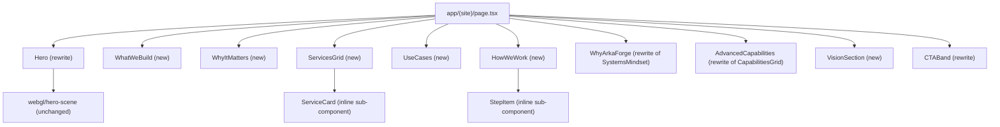
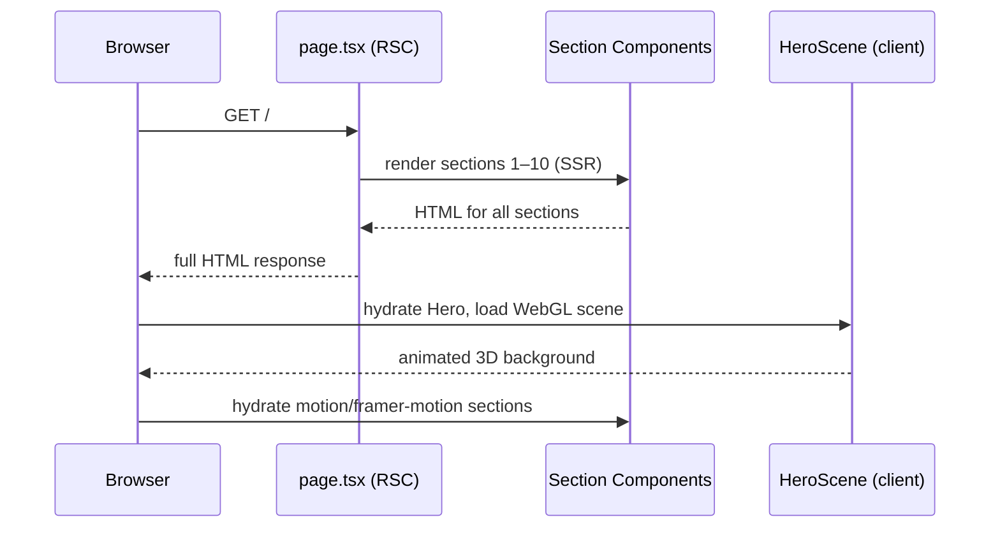

# Design Document: Homepage Restructure

## Overview

Arka Forge's homepage needs to be repositioned from a "Digital Twin Company" identity to a simulation-driven game-based learning and training company. The restructure replaces the current 5-section layout (Hero, CapabilitiesGrid, SystemsMindset, FeaturedWork, CTABand) with a focused 10-section homepage that leads with simulation-based training, establishes commercial credibility for U.S. clients, and demotes digital twins to a supporting capability rather than the primary identity.

The existing Next.js 14 / TypeScript / Tailwind stack is preserved. Most existing components are rewritten in place; several new section components are added. The page composition in `app/(site)/page.tsx` is replaced entirely.

---

## Architecture

### High-Level Component Map



### Section-to-File Mapping

| Section                  | File                                    | Action  |
| ------------------------ | --------------------------------------- | ------- |
| 1. Hero                  | `components/site/hero.tsx`              | Rewrite |
| 2. What We Build         | `components/site/what-we-build.tsx`     | New     |
| 3. Why It Matters        | `components/site/why-it-matters.tsx`    | New     |
| 4. Services              | `components/site/services-grid.tsx`     | New     |
| 5. Use Cases             | `components/site/use-cases.tsx`         | New     |
| 6. How We Work           | `components/site/how-we-work.tsx`       | New     |
| 7. Why Arka Forge        | `components/site/systems-mindset.tsx`   | Rewrite |
| 8. Advanced Capabilities | `components/site/capabilities-grid.tsx` | Rewrite |
| 9. Vision                | `components/site/vision-section.tsx`    | New     |
| 10. CTA Band             | `components/site/cta-band.tsx`          | Rewrite |

`app/(site)/page.tsx` is fully replaced to import and compose all 10 sections.

---

## Sequence: Page Render Flow



---

## Data Models

### ServiceItem

```typescript
interface ServiceItem {
  title: string;
  description: string;
  detail: string; // one-line elaboration shown on hover/expand
  icon: LucideIcon;
  isDeep?: boolean; // true for "Immersive Training Environments" (digital twin depth marker)
}
```

### UseCaseItem

```typescript
interface UseCaseItem {
  label: string; // short label, e.g. "Workforce Training"
  description: string; // 1–2 sentence elaboration
  icon: LucideIcon;
}
```

### WhyItem

```typescript
interface WhyItem {
  title: string;
  description: string;
  icon: LucideIcon;
}
```

### HowWeWorkStep

```typescript
interface HowWeWorkStep {
  step: number; // 1–4
  title: string;
  description: string;
}
```

### AdvancedCapabilityItem

```typescript
interface AdvancedCapabilityItem {
  title: string;
  description: string;
  icon: LucideIcon;
}
```

---

## Section Specifications

### Section 1 — Hero

**File**: `components/site/hero.tsx` (rewrite)

**Purpose**: Establish simulation-driven learning as the primary identity. Convey seriousness, readiness, performance, safety. Remove "Digital Twins · Simulation · Workforce Training" pill and "Forging Intelligent Worlds" headline.

**Copy**:

- Eyebrow pill: `Simulation-Based Training · Game-Based Learning`
- H1: `Training Built for\nReal-World Readiness`
- Body: `Arka Forge builds simulation and game-based learning experiences that prepare people for high-stakes environments — before they ever face the real thing.`
- CTA primary: `Schedule a Meeting` (calendar link, glow button)
- CTA secondary: `See Our Work` → `/work`
- CTA tertiary: `Get in Touch` → `/contact`

**Props interface**:

```typescript
// No external props — self-contained with static copy
export function Hero(): JSX.Element;
```

**Layout**: Unchanged structure (WebGL scene right side desktop, centered mobile). Only copy and pill text change.

---

### Section 2 — What We Build

**File**: `components/site/what-we-build.tsx` (new)

**Purpose**: Concisely name the four product types Arka Forge delivers.

**Copy**:

- Eyebrow: `What We Build`
- H2: `Interactive Experiences for Real-World Training`
- Body: `We design and build training products that put people inside the system — not just in front of a slide deck.`
- Four items (icon + title + description):
  1. **Interactive Training Experiences** — Scenario-driven simulations where learners make decisions, face consequences, and build real competency.
  2. **Simulation Environments** — Faithful digital replicas of real systems, equipment, and workflows — built for practice, not just observation.
  3. **Game-Based Learning Products** — Structured learning delivered through game mechanics: scoring, branching, feedback loops, and measurable outcomes.
  4. **Immersive Operational Learning Systems** — High-fidelity environments for operational readiness, safety training, and systems familiarization.

**Props interface**:

```typescript
interface WhatWeBuildItem {
  title: string;
  description: string;
  icon: LucideIcon;
}
// Component is self-contained, no external props
export function WhatWeBuild(): JSX.Element;
```

**Layout**: 2×2 grid on desktop, single column on mobile. Each card: glass-card, icon top-left, title, description.

---

### Section 3 — Why It Matters

**File**: `components/site/why-it-matters.tsx` (new)

**Purpose**: Make the case for simulation-based training over passive instruction. Six value points.

**Copy**:

- Eyebrow: `Why This Matters`
- H2: `Practice Before the Stakes Are Real`
- Body: `Passive training doesn't build readiness. Simulation does.`
- Six items (icon + title + short description):
  1. **Practice Before Real Stakes** — Learners engage with real scenarios before they face them in the field.
  2. **Safer Mistakes** — Errors happen in the simulation, not on the job. No downtime, no risk.
  3. **Stronger Understanding** — Active engagement builds deeper comprehension than passive instruction.
  4. **Measurable Learning** — Performance data, scoring, and analytics show exactly what was learned.
  5. **Higher Engagement** — Game mechanics and interactivity keep learners focused and motivated.
  6. **Better Decision Readiness** — Repeated practice under simulated pressure builds confident, faster decision-making.

**Props interface**:

```typescript
interface WhyItem {
  title: string;
  description: string;
  icon: LucideIcon;
}
export function WhyItMatters(): JSX.Element;
```

**Layout**: 3-column grid desktop, 2-column tablet, 1-column mobile. Compact cards with icon, title, description.

---

### Section 4 — Services

**File**: `components/site/services-grid.tsx` (new)

**Purpose**: Present exactly three service lines. Digital twins appear inside service #3 as a depth marker, not as a top-level identity.

**Copy**:

- Eyebrow: `Services`
- H2: `Three Ways We Work With You`
- Three service cards:

  **1. Simulation-Based Training**
  - Description: We model your real systems, workflows, and environments — then build training simulations that let people practice inside them. Faster onboarding, fewer errors, measurable readiness.
  - Detail tag: `Systems · Workflows · Equipment`

  **2. Game-Based Learning Experiences**
  - Description: We apply game design — branching scenarios, scoring, feedback loops, and progression — to serious learning objectives. More engaging than e-learning. More effective than passive instruction.
  - Detail tag: `Scenarios · Mechanics · Analytics`

  **3. Immersive Training Environments**
  - Description: For organizations that need the highest fidelity — we build immersive environments that mirror operational reality. This includes digital twin-level simulation where system accuracy, performance analytics, and intelligent environments matter.
  - Detail tag: `Digital Twins · Operational Fidelity · Intelligent Environments`
  - `isDeep: true` (renders a subtle "Advanced Capability" badge)

**Props interface**:

```typescript
interface ServiceItem {
  title: string;
  description: string;
  detailTag: string;
  icon: LucideIcon;
  isDeep?: boolean;
}
export function ServicesGrid(): JSX.Element;
```

**Layout**: 3-column on desktop (lg), stacked on mobile. Cards are larger than capability cards — more prominent. The `isDeep` card gets a faint accent border to signal depth without shouting.

---

### Section 5 — Use Cases

**File**: `components/site/use-cases.tsx` (new)

**Purpose**: Show the range of industries and training contexts Arka Forge serves.

**Copy**:

- Eyebrow: `Who It's For`
- H2: `Built for Organizations That Train for Real`
- Body: `From workforce onboarding to high-stakes operational readiness — if your training needs to reflect reality, we can build it.`
- Six use case items:
  1. **Workforce Training** — Onboarding, upskilling, and continuous training for frontline and technical teams.
  2. **Onboarding & Process Learning** — Get new hires productive faster with simulation-based process walkthroughs.
  3. **Safety & Compliance** — Train for hazardous scenarios, emergency procedures, and compliance requirements — without real-world risk.
  4. **Technical Education & Skilling** — Build deep technical competency through hands-on simulation of complex systems.
  5. **Operational Simulations** — Rehearse critical operations, decision trees, and workflows before execution.
  6. **Equipment & Systems Familiarization** — Let teams interact with equipment and systems digitally before physical access.

**Props interface**:

```typescript
interface UseCaseItem {
  label: string;
  description: string;
  icon: LucideIcon;
}
export function UseCases(): JSX.Element;
```

**Layout**: 2×3 grid desktop, 2-column tablet, 1-column mobile. Compact cards.

---

### Section 6 — How We Work

**File**: `components/site/how-we-work.tsx` (new)

**Purpose**: Four-step process that builds confidence in Arka Forge's delivery approach.

**Copy**:

- Eyebrow: `How We Work`
- H2: `From System to Simulation`
- Four steps:
  1. **Understand the System** — We start by mapping the real workflow, environment, or system your training needs to reflect.
  2. **Design the Training Experience** — We define learning objectives, scenarios, and interaction models before a line of code is written.
  3. **Build the Simulation** — We develop the interactive experience using game technology, simulation design, and immersive delivery.
  4. **Deploy and Refine** — We ship, measure, and iterate — using performance data to improve training outcomes over time.

**Props interface**:

```typescript
interface HowWeWorkStep {
  step: number;
  title: string;
  description: string;
}
export function HowWeWork(): JSX.Element;
```

**Layout**: Horizontal stepper on desktop (4 columns with step numbers and connecting line), vertical on mobile. Step number rendered as large muted numeral.

---

### Section 7 — Why Arka Forge

**File**: `components/site/systems-mindset.tsx` (rewrite)

**Purpose**: Replace "Why Digital Twins" with the five differentiators that make Arka Forge the right choice for U.S. clients.

**Copy**:

- Eyebrow: `Why Arka Forge`
- H2: `A Different Kind of Training Partner`
- Body: `We bring game-tech thinking to real-world training problems — with the execution quality and delivery efficiency to back it up.`
- Five items:
  1. **Game-Tech Mindset** — We apply the design principles that make games engaging to the training problems that matter most.
  2. **Stronger Than Passive E-Learning** — Our simulations produce measurably better engagement, retention, and readiness than slide-based instruction.
  3. **Premium Execution, Efficient Delivery** — High-quality output with India-based production efficiency — without compromising on craft.
  4. **Global Client Readiness** — U.S.-accessible, globally capable. We work with organizations across markets and time zones.
  5. **Digital Twin Depth When You Need It** — For high-fidelity requirements, we go deeper — intelligent environments, operational analytics, and system-accurate simulation.

**Props interface**:

```typescript
interface WhyItem {
  title: string;
  description: string;
  icon: LucideIcon;
}
export function SystemsMindset(): JSX.Element;
// Note: filename kept as systems-mindset.tsx to avoid import churn
```

**Layout**: 3-column grid (first row), 2-column grid (second row) on desktop — or uniform 3-col with last two centered. Mobile: single column.

---

### Section 8 — Advanced Capabilities

**File**: `components/site/capabilities-grid.tsx` (rewrite)

**Purpose**: Surface digital twins, intelligent environments, analytics, and adaptive systems explicitly — but positioned as depth, not identity.

**Copy**:

- Eyebrow: `Advanced Capabilities`
- H2: `When You Need More Fidelity`
- Body: `For organizations where simulation accuracy, operational realism, and intelligent environments matter — we go deeper.`
- Four items:
  1. **Digital Twins** — Accurate, interactive replicas of real systems — factories, equipment, workflows — that behave like the real thing.
  2. **Intelligent Environments** — Simulation environments that respond dynamically to learner behavior, operational inputs, and real-world data.
  3. **Performance Analytics** — Built-in scoring, tracking, and analytics that measure readiness and surface training gaps.
  4. **Adaptive Systems** — Training that adjusts difficulty, scenarios, and feedback based on individual learner performance.

**Props interface**:

```typescript
interface AdvancedCapabilityItem {
  title: string;
  description: string;
  icon: LucideIcon;
}
export function CapabilitiesGrid(): JSX.Element;
// Note: filename kept as capabilities-grid.tsx to avoid import churn
```

**Layout**: 2×2 grid on desktop, single column on mobile. No external links on cards (unlike current version which links to /technology/\* pages).

---

### Section 9 — Vision

**File**: `components/site/vision-section.tsx` (new)

**Purpose**: Short, forward-looking section. Signals ambition without overpromising. Keeps focus on near-term delivery.

**Copy**:

- Eyebrow: `Vision`
- H2: `Building Toward Intelligent Simulation`
- Body (2 sentences): `Today, Arka Forge is focused on winning and delivering high-value simulation and learning work. Over time, we're building toward deeper digital twin systems, intelligent environments, and broader interactive products that close the gap between training and operational reality.`

**Props interface**:

```typescript
export function VisionSection(): JSX.Element;
```

**Layout**: Centered, single-column, constrained width (max-w-2xl). Minimal — no cards, no icons. Subtle ambient glow background. Not a full-height section.

---

### Section 10 — CTA Band

**File**: `components/site/cta-band.tsx` (rewrite)

**Purpose**: Clear, direct call to action. Start a conversation.

**Copy**:

- Eyebrow: `Let's Talk`
- H2: `Ready to Build Something Real?`
- Body: `If you're looking to transform training, onboarding, or operational readiness — we'd like to hear about it. Tell us what you're working on.`
- CTA primary: `Start a Conversation` → `/contact` (glow button)
- CTA secondary: `Schedule a Meeting` → calendar link (outline button)

**Props interface**:

```typescript
export function CTABand(): JSX.Element;
```

---

## Page Composition

### `app/(site)/page.tsx` — Replacement

```typescript
import { Hero } from "@/components/site/hero"
import { WhatWeBuild } from "@/components/site/what-we-build"
import { WhyItMatters } from "@/components/site/why-it-matters"
import { ServicesGrid } from "@/components/site/services-grid"
import { UseCases } from "@/components/site/use-cases"
import { HowWeWork } from "@/components/site/how-we-work"
import { SystemsMindset } from "@/components/site/systems-mindset"
import { CapabilitiesGrid } from "@/components/site/capabilities-grid"
import { VisionSection } from "@/components/site/vision-section"
import { CTABand } from "@/components/site/cta-band"

export default function HomePage() {
  return (
    <>
      <Hero />
      <WhatWeBuild />
      <WhyItMatters />
      <ServicesGrid />
      <UseCases />
      <HowWeWork />
      <SystemsMindset />
      <CapabilitiesGrid />
      <VisionSection />
      <CTABand />
    </>
  )
}
```

---

## What Gets Removed / Demoted

| Element                                                         | Current Location          | Action                                                              |
| --------------------------------------------------------------- | ------------------------- | ------------------------------------------------------------------- |
| "Digital Twin Company" identity                                 | Hero pill, footer tagline | Remove from hero pill; footer tagline updated                       |
| "Forging Intelligent Worlds" headline                           | `hero.tsx`                | Replaced with "Training Built for Real-World Readiness"             |
| "Digital Twins · Simulation · Workforce Training" pill          | `hero.tsx`                | Replaced with "Simulation-Based Training · Game-Based Learning"     |
| `SystemsMindset` "Why Digital Twins" section                    | `systems-mindset.tsx`     | Rewritten as "Why Arka Forge"                                       |
| `CapabilitiesGrid` with XR as top-level item                    | `capabilities-grid.tsx`   | Rewritten; XR removed, replaced with Adaptive Systems               |
| Links to `/technology/xr` from homepage                         | `capabilities-grid.tsx`   | Removed (XR page still exists, just not linked from homepage cards) |
| `FeaturedLabs` section                                          | `page.tsx`                | Removed from homepage (labs still accessible via nav)               |
| `FeaturedWork` section                                          | `page.tsx`                | Removed from homepage (work still accessible via nav)               |
| Footer tagline "Digital twin company — interactive replicas..." | `footer.tsx`              | Updated to reflect new positioning                                  |

---

## Footer Update

**File**: `components/site/footer.tsx`

The tagline in the footer brand column changes from:

> "Digital twin company — interactive replicas of real-world systems for workforce training and operations."

To:

> "Simulation-based training and game-based learning experiences for real-world readiness."

---

## Error Handling

All new section components are pure presentational components with static data — no async operations, no error boundaries needed beyond what Next.js provides by default.

The `FeaturedWork` async server component is removed from the homepage. It remains available at `/work`. No data-fetching risk on the homepage.

---

## Testing Strategy

### Unit Testing Approach

Each new section component renders static data. Snapshot tests confirm copy and structure don't regress. Test that `isDeep` prop on `ServicesGrid` renders the "Advanced Capability" badge.

### Property-Based Testing Approach

Not applicable for static presentational components.

### Integration Testing Approach

E2E smoke test: homepage loads, all 10 section headings are present in the DOM, CTA links resolve correctly, calendar link has correct `href`.

---

## Performance Considerations

- Removing `FeaturedWork` and `FeaturedLabs` from the homepage eliminates two async server component data fetches on the critical path — improving TTFB.
- All new sections are static/synchronous — no additional data fetching.
- WebGL hero scene is unchanged (already lazy-loaded with `dynamic` + `ssr: false`).
- `framer-motion` animations are already in the bundle; new sections follow the same `whileInView` pattern.

---

## Security Considerations

No new data inputs, API calls, or user-facing forms are introduced on the homepage. The calendar link (`https://calendar.app.google/...`) is an external link and already uses `rel="noopener noreferrer"`.

---

## Dependencies

No new dependencies required. All new components use:

- `framer-motion` (already installed)
- `lucide-react` (already installed)
- `@/components/ui/button` (already exists)
- Tailwind utility classes (already configured)
- Existing `glass-card`, `glass-pill`, `gradient-text`, `glow` CSS utility classes from `app/globals.css`

---

## Correctness Properties

_A property is a characteristic or behavior that should hold true across all valid executions of a system — essentially, a formal statement about what the system should do. Properties serve as the bridge between human-readable specifications and machine-verifiable correctness guarantees._

### Property 1: All section items have non-empty required fields

_For any_ rendered section (WhatWeBuild, WhyItMatters, UseCases), every item in the section's data array should have a non-empty title/label and a non-empty description.

**Validates: Requirements 3.3, 4.3, 6.3**

### Property 2: isDeep badge exclusivity

_For any_ list of service cards, a card renders the "Advanced Capability" badge if and only if its `isDeep` field is `true`.

**Validates: Requirements 5.6, 5.7**

### Property 3: HowWeWork steps are sequential

_For any_ rendering of the HowWeWork section, the step numbers displayed should form a consecutive sequence starting at 1 with no gaps or duplicates.

**Validates: Requirements 7.3**

### Property 4: CapabilitiesGrid contains no /technology/ links

_For any_ rendering of the CapabilitiesGrid section, no anchor element within the section should have an `href` that begins with `/technology/`.

**Validates: Requirements 9.7**

### Property 5: Homepage section order is preserved

_For any_ rendering of the Homepage, the ten section components should appear in the DOM in the order: Hero → WhatWeBuild → WhyItMatters → ServicesGrid → UseCases → HowWeWork → SystemsMindset → CapabilitiesGrid → VisionSection → CTABand.

**Validates: Requirements 12.1, 12.2**
